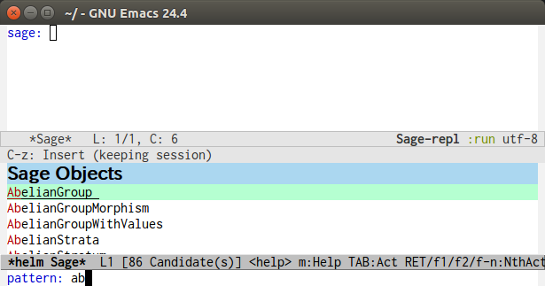
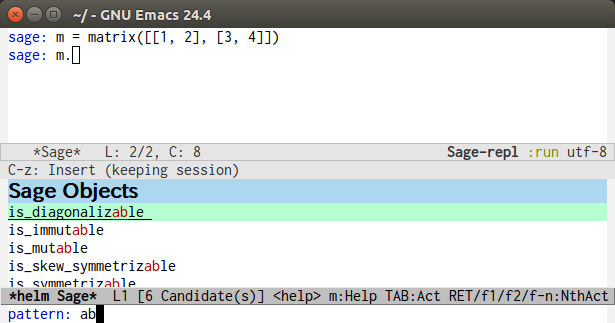

[![melpa badge][melpa-badge]][melpa-link] [![melpa stable badge][melpa-stable-badge]][melpa-stable-link]

# Overview

`sage-shell-mode` is an elisp package and
provides an Emacs front end for [Sage](http://www.sagemath.org/).

By `sage-shell-mode`, you can run Sage process in GNU Emacs and send
contents of a buffer or a file to the Sage process.

This package also provides a major-mode derived from `python-mode`.

There are extensions for this package,
[auto-complete-sage](https://github.com/stakemori/auto-complete-sage),
[helm-sage](https://github.com/stakemori/helm-sage) and
[anything-sage](https://github.com/stakemori/anything-sage).


# Installation
You can install `sage-shell-mode` from
[MELPA](https://github.com/milkypostman/melpa.git) by package.el
(`M-x package-install sage-shell-mode`).

If `M-: (executable-find "sage")` is non-nil, you do not need the setting below.

If `M-: (executable-find "sage")` is nil,
put the following line to `~/.emacs.d/init.el`.
```lisp
(setq sage-shell:sage-root "/path/to/sage/root_directory")
```
And replace `/path/to/sage_root_directory` by the root directory of Sage,
i.e. `$SAGE_ROOT`.

If you do not know the root directory of Sage,
evaluate the following code in Sage:

```python
import os; print os.environ["SAGE_ROOT"]
```

Alternatively, instead of setting `sage-shell:sage-root`,
you may set the variable `sage-shell:sage-executable`.

```lisp
(setq sage-shell:sage-executable "/path/to/sage/executable")
```
Here `"/path/to/sage/executable"` is the path of the executable file of Sage.
This may be a symbolic link.

# Aliases
The major mode `sage-mode` and the command `run-sage` are provided by
[sage-mode](https://bitbucket.org/gvol/sage-mode/src)
(the official `sage-mode`).
To avoid name conflicts, `sage-shell-mode` uses redundant names.
By putting the following lines in `~/.emacs.d/init.el`,
```lisp
(dolist (c sage-shell:func-alias-alist)
  (defalias (cdr c) (car c)))
(dolist (c sage-shell:var-alias-alist)
  (defvaralias (cdr c) (car c)))
```
the following aliases will be defined.


| Original name                     | Alias                  |
|-----------------------------------|------------------------|
| sage-shell:run-sage               | run-sage               |
| sage-shell:run-new-sage           | run-new-sage           |
| sage-shell:sage-mode              | sage-mode              |
| sage-shell:sage-mode-map          | sage-mode-map          |
| sage-shell:sage-mode-hook         | sage-mode-hook         |

Then you can run Sage by `M-x run-sage` instead of `M-x sage-shell:run-sage`
with these aliases.

# Basic Usage
## Running a Sage process
You can run Sage by `M-x sage-shell:run-sage`.
You can run new Sage process by `M-x sage-shell:run-new-sage`.

| Command                 | Alias        | Description              |
|-------------------------|--------------|--------------------------|
| sage-shell:run-sage     | run-sage     | Run a Sage process.      |
| sage-shell:run-new-sage | run-new-sage | Run a new Sage process.  |

The major-mode of the Sage process buffer is `sage-shell-mode`.
The basic key-bidings in `sage-shell-mode` are as follows:

| Key Stroke | Command                         | Description                                                                     |
|------------|---------------------------------|---------------------------------------------------------------------------------|
| RET        | sage-shell:send-input           | Send the current input to the Sage process.                                     |
| TAB        | sage-shell-tab-command          | Complete words at the point or indent a line.                                   |
| C-d        | sage-shell:delchar-or-maybe-eof | Delete backward a character or send EOF if there are no inputs.                 |
| C-c C-c    | sage-shell:interrupt-subjob     | Interrupt the current subjob.                                                   |
| M-p        | comint-previous-input           | Go backward through input history.                                              |
| M-n        | sage-shell:next-input           | Go forward through input history.                                               |
| C-c C-o    | sage-shell:delete-output        | Delete all outputs since last input.                                            |
| C-c M-o    | sage-shell:clear-current-buffer | Delete all outputs in the current buffer. This does not delete the last prompt. |
| C-c C-l    | sage-shell:load-file            | Send contents of a file to the Sage process.                                    |
| C-c C-h    | sage-shell:help                 | Show a document string of a Sage object.                                        |

For more commands and key-bindings see the help by `M-x describle-mode sage-shell-mode`.

## TAB completion

By default, `TAB` completion uses `completion-at-point`.
You can use `pcomplete` by the following setting:

```lisp
(setq sage-shell:completion-function 'pcomplete)
```
You can also use `auto-complete`, `anything` and `helm` for completion.
This requires extensions.

## Editing a Sage file
When you visit a file ended with ``".sage"``,
then `sage-shell:sage-mode` will be the major-mode of the buffer
automatically.
If you want to edit a file ended with `".py"` in `sage-shell:sage-mode`,
then use the following magic comment at the first line of the file:
```python
# -*- mode: sage-shell:sage -*-
```
With aliases above, instead of the line above you can use the following magic
comment:
```python
# -*- mode: sage -*-
```


The major mode `sage-shell:sage-mode` is almost same as `python-mode`
you use.
The differences are some of key-bidings.

The basic key-bidings in `sage-shell:sage-mode` are as follows:

| Key     | Command                               | Description                             |
|---------|---------------------------------------|-----------------------------------------|
| C-c C-c | sage-shell-edit:send-buffer           | Send the current buffer to the process. |
| C-c C-r | sage-shell-edit:send-region           | Send the region to the process.         |
| C-c C-j | sage-shell-edit:send-line             | Send the current line to the process.   |
| C-c C-l | sage-shell-edit:load-file             | Send the file to the process.           |
| C-c C-z | sage-shell-edit:pop-to-process-buffer | Pop to the process buffer.              |

If you run multiple Sage processes, you can choose which process to send
by `M-x sage-shell:set-process-buffer`.

# Extensions
* [auto-complete-sage](https://github.com/stakemori/auto-complete-sage) provides an
  [auto-complete](https://github.com/auto-complete/auto-complete)
  source for `sage-shell-mode`.
* [helm-sage](https://github.com/stakemori/helm-sage) provides a
  [helm](https://github.com/emacs-helm/helm) source for `sage-shell-mode`.

* [anything-sage](https://github.com/stakemori/anything-sage)
  provides an [anything](http://www.emacswiki.org/Anything)
  source for `sage-shell-mode`.

# Screenshots
Automatic indentation and syntax highlighting work.


Completion with [auto-complete-sage](https://github.com/stakemori/auto-complete-sage).


Completion with [helm-sage](https://github.com/stakemori/helm-sage).





# Workaround for `flycheck`
To use `flycheck-mode` in a `sage-shell:sage-mode` buffer and a
`python-mode` buffer, try the following code.

```lisp
(defun sage-shell:flycheck-add-mode (checker mode)
  "Add `mode' to `checker'."
  (let ((modes (get checker 'flycheck-modes)))
    (unless (memq mode modes)
      (put checker 'flycheck-modes (cons mode modes)))))

(dolist (ckr '(python-pylint python-flake8))
  (sage-shell:flycheck-add-mode ckr 'sage-shell:sage-mode))

(defun sage-shell:flycheck-turn-on ()
  "Enable flycheck-mode only in a file ended with py."
  (when (let ((bfn (buffer-file-name)))
          (and bfn (string-match (rx ".py" eol) bfn)))
    (flycheck-mode 1)))

(add-hook 'python-mode-hook 'sage-shell:flycheck-turn-on)
```

# License

Licensed under the [GPL Version 3][GPL]
[GPL]: http://www.gnu.org/licenses/gpl.html
[melpa-link]: http://melpa.org/#/sage-shell-mode
[melpa-stable-link]: http://stable.melpa.org/#/sage-shell-mode
[melpa-badge]: http://melpa.org/packages/sage-shell-mode-badge.svg
[melpa-stable-badge]: http://stable.melpa.org/packages/sage-shell-mode-badge.svg
